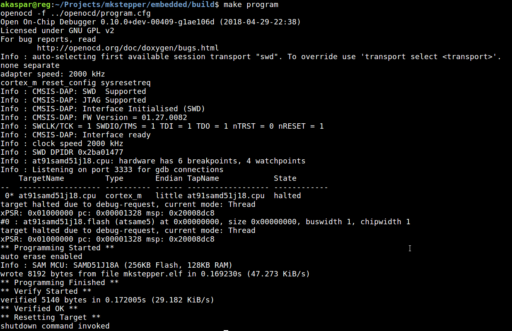
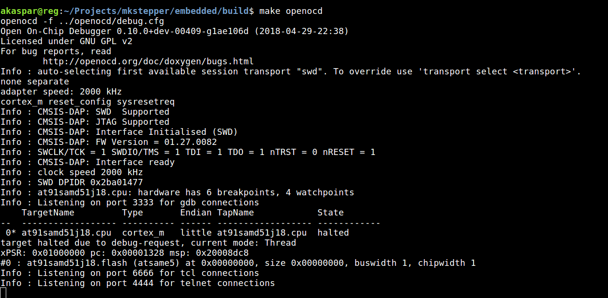

# Compiling and programming the ATSAMD51J18A

First, install the patched version of [openocd](../openocd/README.md).
This assumes you did it successfuly and have it correctly programed in your path.

To compile the code, you can just use `make`.
The extra targets of interest are:

* `make clean` to clean your environment (sometimes needed before compiling, if things changed but were not discovered)
* `make program` to program the binary onto the chip using openocd
* `make openocd` to start openocd for debugging
* `make debug` to use gdb to debug the chip via openocd


## Programming

For `make program` to work, you need to have the correct openocd binary accessible in the path.
If it's not the default one, change it in `Makefile`.

You also need to be connected to your programming tool.
The configuration assumes an ATMEL ICE programmer, but you can easily change that in `program.cfg` and `debug.cfg` (if needed, might work by default).

A successful programming looks like that:


## Debugging with GDB

For debug, you need to start openocd with the debug configuration.
In one terminal, do

```
make openocd
```

If everything is well, this is what you should get:


and in the other, you can start the gdb session with

```
make debug
```

Type c+(ENTER) to continue the program (it halts by default).

Type (CTRL)+c to stop the program. The rest is all with `gdb`.
